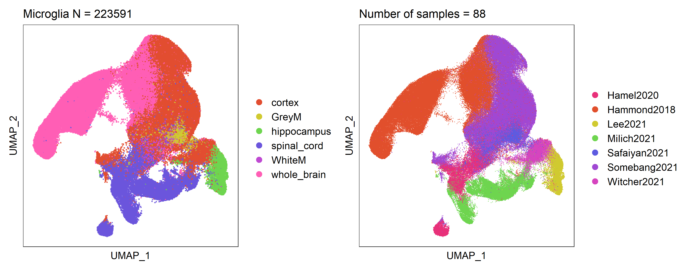

# MicrogliaMegaAtlas

The biggest microglia single-cell RNAseq dataset ever

## Summary Statistics

Study
Hammond2018 | Somebang2021 | Milich2021 | Hamel2020 | Safaiyan2021 | Lee2021 | Witcher2021
--- | --- | --- | --- | --- | --- | ---
79937 | 77358 | 21221 | 16598 | 10626 | 8941 | 8910

Tissue
cortex | whole_brain | spinal_cord | hippocampus | GreyM | WhiteM
--- | --- | --- | --- | --- | ---
86268 | 79937 | 37819 | 8941 | 6036 | 4590

Injury_model
TBI | Healthy | SCI | Aging | mouseAD
--- | --- | --- | --- | ---
86268 | 79937 | 37819 | 10626 | 8941

Sex
M | F
--- | ---
57864 | 31014

Age
P720 | P600
--- | ---
10626 | 8941

